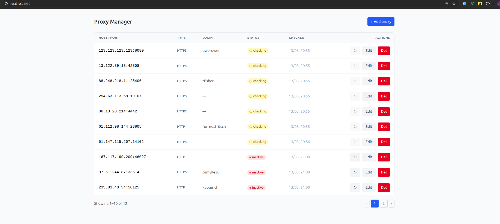

# Proxy Manager

## Stack

- **Backend**: PHP 8.2 / Laravel 12
- **Frontend**: Vue 3 (Composition API) / Vite
- **DB**: MySQL 8
- **Cache / Queue**: Redis 7
- **Proxy**: Nginx



## Quick start

```bash
# 1. Build and start containers
make build

# 2. First-time setup (copy .env, install deps, migrate)
docker compose exec php cp .env.example .env
docker compose exec php composer install
docker compose exec php php artisan key:generate
docker compose exec php php artisan migrate
docker compose exec php php artisan db:seed
```

App → **http://localhost:8080**

## API

Base URL: `http://localhost:8080/api/v1`

| Method | Endpoint | Description |
|---|---|---|
| GET | `/proxies` | List all proxies |
| POST | `/proxies` | Create proxy |
| GET | `/proxies/{id}` | Get proxy |
| PUT | `/proxies/{id}` | Update proxy |
| DELETE | `/proxies/{id}` | Delete proxy |
| POST | `/proxies/{id}/check` | Trigger manual health check |

### Proxy object

```json
{
  "id": 1,
  "host": "192.168.1.1",
  "port": 8080,
  "type": "http",
  "login": "user",
  "status": "active",
  "last_checked_at": "2026-03-13T10:00:00+00:00",
  "created_at": "2026-03-13T09:00:00+00:00",
  "updated_at": "2026-03-13T10:00:00+00:00"
}
```

Proxy types: `http` | `https` | `socks5`
Proxy statuses: `active` | `inactive` | `checking`